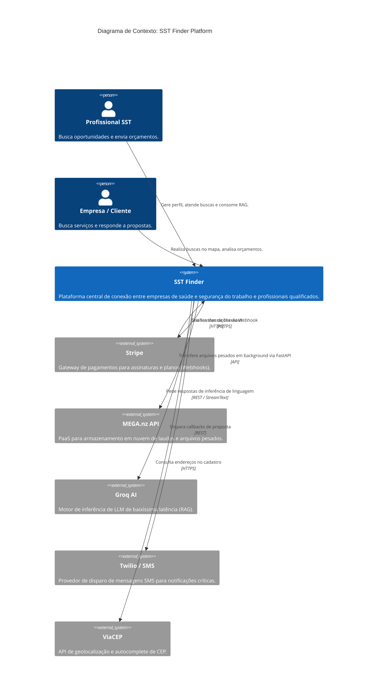
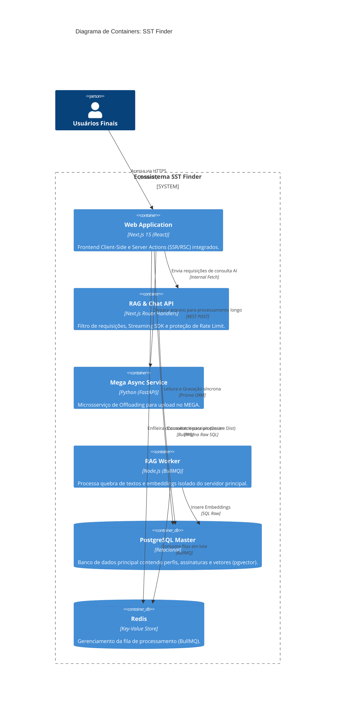
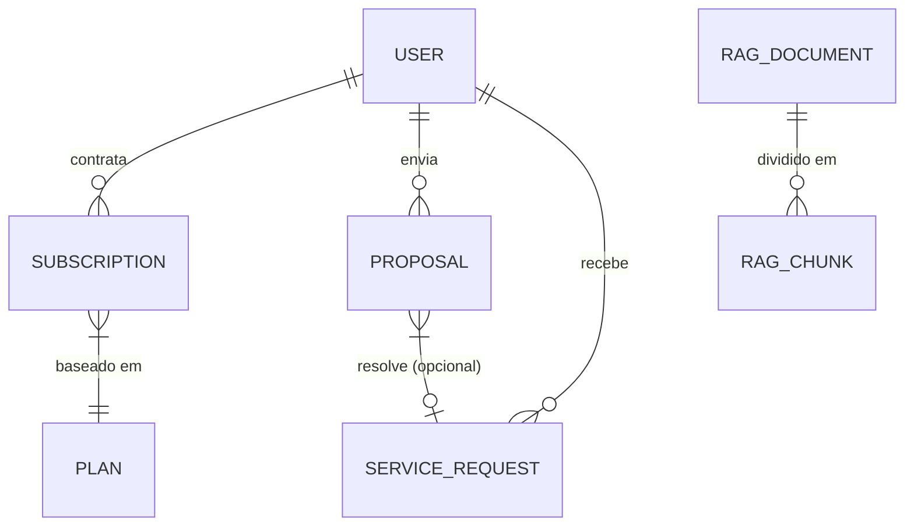

# Arquitetura do Sistema — SST Finder (C4 Model)

> Gerado pelo Reversa Architect em 2026-05-02

## Nível 1: Contexto de Sistema

O diagrama abaixo apresenta uma visão holística das interações do sistema SST Finder com os atores principais (Profissional, Empresa) e provedores de serviços externos.

## Nível 2: Diagrama de Containers

Visão arquitetural profunda detalhando os contêineres e aplicações separadas que mantêm a plataforma viva.

## Relacionamentos de Dados (ERD Parcial de Alta Importância)

O esquema central que liga os profissionais às oportunidades financeiras e à IA.

