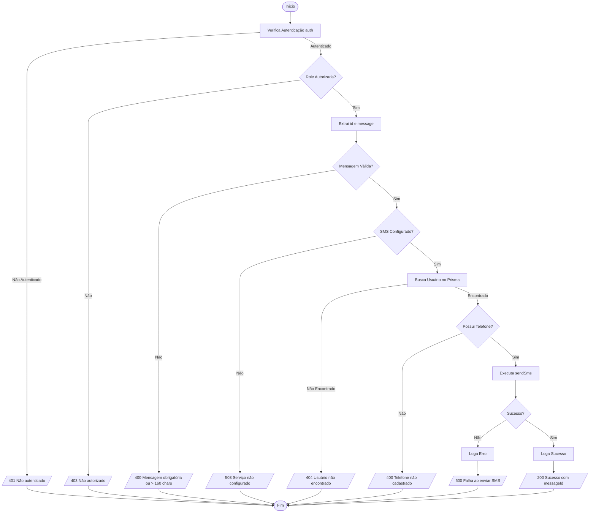

# Fluxograma: Função `POST /api/admin/users/[id]/sms`

Esta função processa o envio de SMS por um administrador para um usuário específico.

### Regras de Negócio Identificadas 🟢
1.  **Autorização Estrita**: Somente ADMIN, SUPER_ADMIN ou SUPPORT podem disparar SMS.
2.  **Limite de Caracteres**: Máximo de 160 caracteres (padrão SMS single-segment).
3.  **Fallback de Telefone**: Prioriza telefone do perfil Profissional, depois Empresa.
4.  **Logging**: Todo envio bem-sucedido é logado com o ID do administrador responsável.
