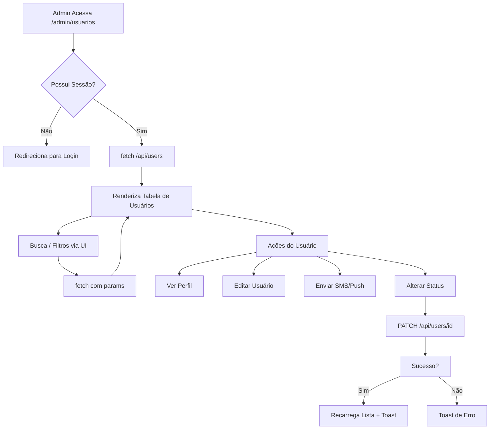
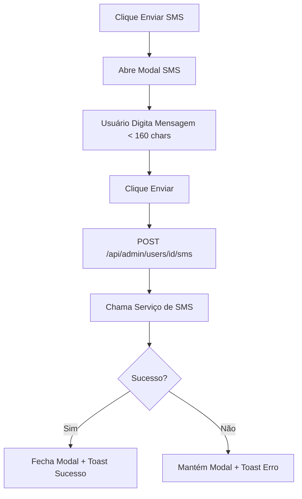

# Fluxogramas: Módulo Admin

## Fluxo de Gestão de Usuários

```mermaid
graph TD
    A[Admin Acessa /admin/usuarios] --> B{Possui Sessão?}
    B -- Não --> C[Redireciona para Login]
    B -- Sim --> D[fetch /api/users]
    D --> E[Renderiza Tabela de Usuários]
    E --> F[Busca / Filtros via UI]
    F --> G[fetch com params]
    G --> E
    
    E --> H[Ações do Usuário]
    H --> I[Ver Perfil]
    H --> J[Editar Usuário]
    H --> K[Enviar SMS/Push]
    H --> L[Alterar Status]
    
    L --> M[PATCH /api/users/id]
    M --> N[Sucesso?]
    N -- Sim --> O[Recarrega Lista + Toast]
    N -- Não --> P[Toast de Erro]
```

## Fluxo de Envio de Notificação (SMS)

```mermaid
graph TD
    Start[Clique Enviar SMS] --> Modal[Abre Modal SMS]
    Modal --> Input[Usuário Digita Mensagem < 160 chars]
    Input --> Send[Clique Enviar]
    Send --> API[POST /api/admin/users/id/sms]
    API --> Service[Chama Serviço de SMS]
    Service --> Response{Sucesso?}
    Response -- Sim --> Success[Fecha Modal + Toast Sucesso]
    Response -- Não --> Error[Mantém Modal + Toast Erro]
```
