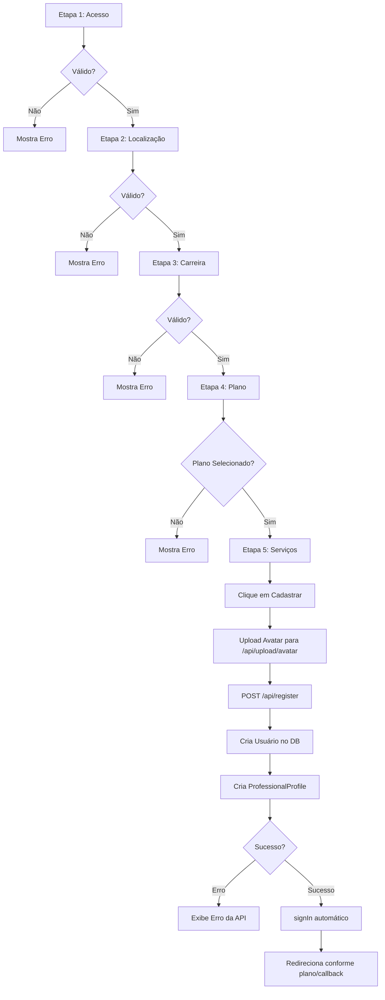

# Fluxograma Detalhado: Registro de Profissional

O registro é um processo de 5 etapas com validações intermediárias e auto-login final.

### Regras de Negócio do Cadastro 🟢
1.  **Validação de Senha**: Mínimo de 8 caracteres.
2.  **Unicidade**: O e-mail deve ser único (verificado na API).
3.  **Filtragem de Áreas**:
    - Se especialidade incluir "Ambiental" -> Prefixo de Plano **MA**.
    - Caso contrário -> Prefixo de Plano **SST**.
4.  **Limites do Plano**:
    - O frontend bloqueia seleções acima do limite (ex: 13 para BASIC).
    - A API valida se o `planName` enviado é coerente com o número de serviços.
