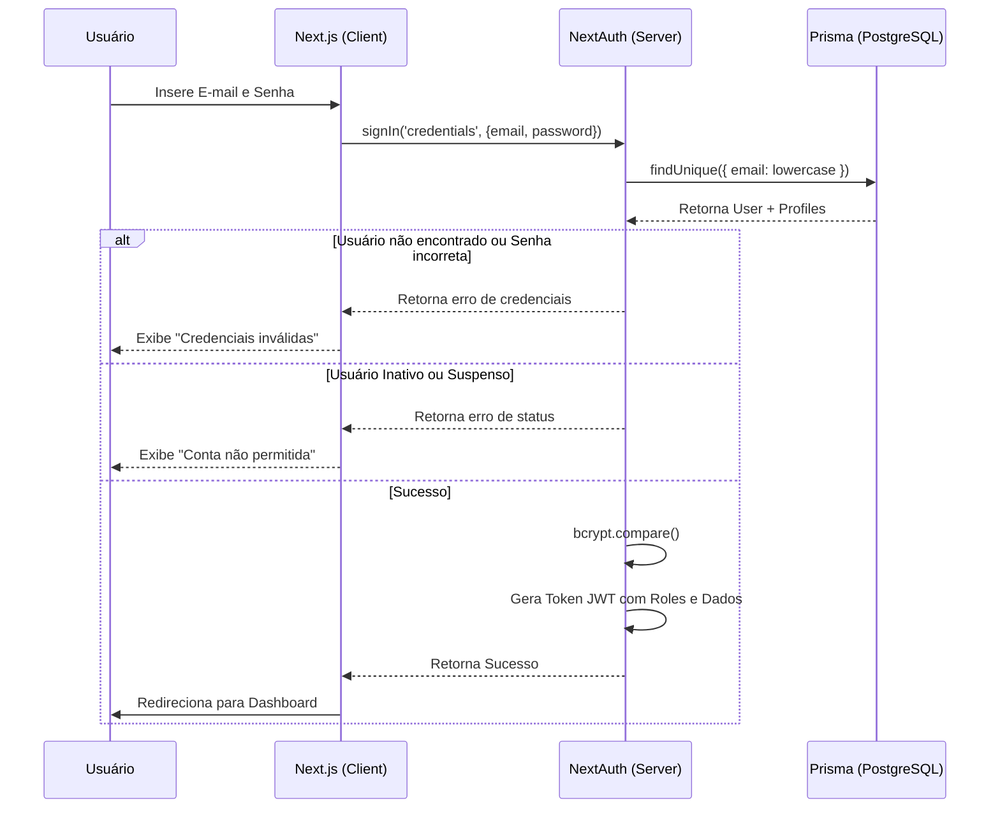

# Fluxogramas: Módulo Auth

## Fluxo de Autenticação (Login)



## Middleware de Proteção de Rotas

```mermaid
graph TD
    Request[Requisição para /rota] --> Public{É Rota Pública?}
    Public -- Sim --> Allow[Permite Acesso]
    Public -- Não --> Authed{Usuário Logado?}
    
    Authed -- Não --> Login[Redireciona para /entrar]
    Authed -- Sim --> Admin{Rota /admin?}
    
    Admin -- Não --> Allow
    Admin -- Sim --> RoleCheck{Role = ADMIN?}
    
    RoleCheck -- Sim --> Allow
    RoleCheck -- Não --> Forbidden[Redireciona para / (Home)]
```
