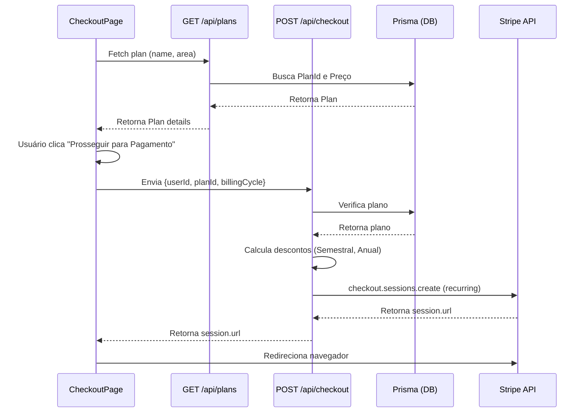
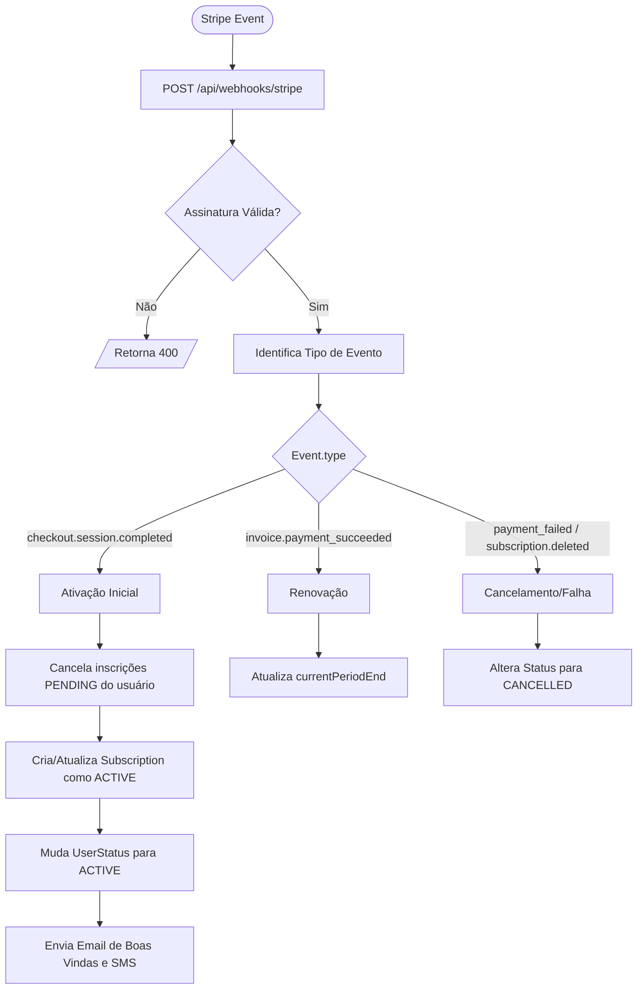

# Fluxogramas: Módulo Checkout e Pagamentos

## Fluxo de Checkout (Frontend para Stripe)

```mermaid
sequenceDiagram
    participant UI as CheckoutPage
    participant API_P as GET /api/plans
    participant API_C as POST /api/checkout
    participant DB as Prisma (DB)
    participant Stripe as Stripe API

    UI->>API_P: Fetch plan (name, area)
    API_P->>DB: Busca PlanId e Preço
    DB-->>API_P: Retorna Plan
    API_P-->>UI: Retorna Plan details
    
    UI->>UI: Usuário clica "Prosseguir para Pagamento"
    UI->>API_C: Envia {userId, planId, billingCycle}
    
    API_C->>DB: Verifica plano
    DB-->>API_C: Retorna plano
    API_C->>API_C: Calcula descontos (Semestral, Anual)
    
    API_C->>Stripe: checkout.sessions.create (recurring)
    Stripe-->>API_C: Retorna session.url
    API_C-->>UI: Retorna session.url
    
    UI->>Stripe: Redireciona navegador
```

## Fluxo de Webhook (Stripe para Backend)

```mermaid
flowchart TD
    Stripe([Stripe Event]) --> Webhook[POST /api/webhooks/stripe]
    Webhook --> Verify{Assinatura Válida?}
    
    Verify -- Não --> Error[/Retorna 400/]
    Verify -- Sim --> Parse[Identifica Tipo de Evento]
    
    Parse --> Type{Event.type}
    
    Type -- checkout.session.completed --> Setup[Ativação Inicial]
    Setup --> CancelPending[Cancela inscrições PENDING do usuário]
    CancelPending --> UpsertSub[Cria/Atualiza Subscription como ACTIVE]
    UpsertSub --> AtivaUser[Muda UserStatus para ACTIVE]
    AtivaUser --> EmailSms[Envia Email de Boas Vindas e SMS]
    
    Type -- invoice.payment_succeeded --> Renew[Renovação]
    Renew --> UpdateDate[Atualiza currentPeriodEnd]
    
    Type -- payment_failed / subscription.deleted --> Cancel[Cancelamento/Falha]
    Cancel --> StatusCancel[Altera Status para CANCELLED]
```
