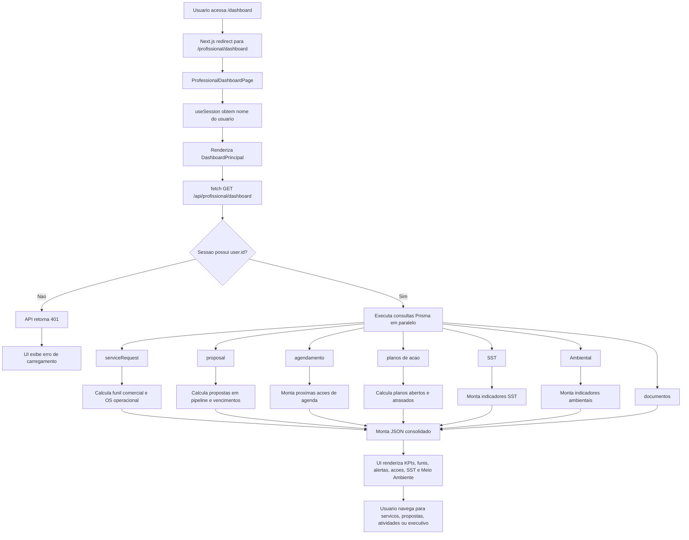
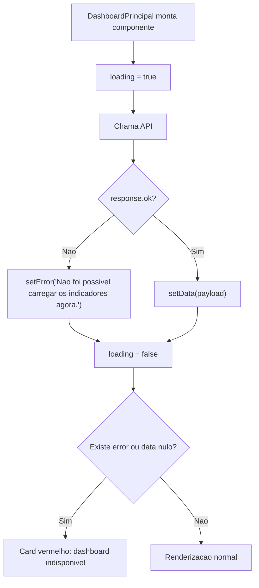
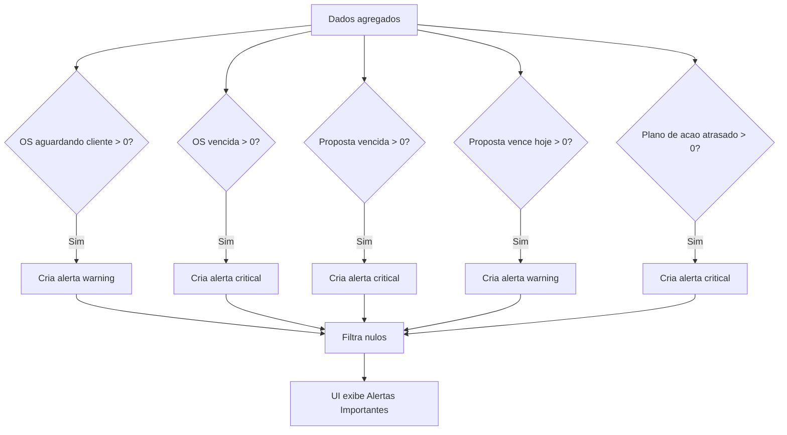

# Fluxograma - Dashboard Principal

Data da nova analise: 2026-06-12

```mermaid
flowchart TD
    A["Usuario acessa /dashboard"] --> B["Next.js redirect para /profissional/dashboard"]
    B --> C["ProfessionalDashboardPage"]
    C --> D["useSession obtem nome do usuario"]
    D --> E["Renderiza DashboardPrincipal"]
    E --> F["fetch GET /api/profissional/dashboard"]

    F --> G{"Sessao possui user.id?"}
    G -- "Nao" --> H["API retorna 401"]
    H --> I["UI exibe erro de carregamento"]

    G -- "Sim" --> J["Executa consultas Prisma em paralelo"]
    J --> K["serviceRequest"]
    J --> L["proposal"]
    J --> M["agendamento"]
    J --> N["documentos"]
    J --> O["planos de acao"]
    J --> P["SST"]
    J --> Q["Ambiental"]

    K --> R["Calcula funil comercial e OS operacional"]
    L --> S["Calcula propostas em pipeline e vencimentos"]
    M --> T["Monta proximas acoes de agenda"]
    O --> U["Calcula planos abertos e atrasados"]
    P --> V["Monta indicadores SST"]
    Q --> W["Monta indicadores ambientais"]

    R --> X["Monta JSON consolidado"]
    S --> X
    T --> X
    U --> X
    V --> X
    W --> X
    N --> X

    X --> Y["UI renderiza KPIs, funis, alertas, acoes, SST e Meio Ambiente"]
    Y --> Z["Usuario navega para servicos, propostas, atividades ou executivo"]
```

## Fluxo de erro

```mermaid
flowchart TD
    A["DashboardPrincipal monta componente"] --> B["loading = true"]
    B --> C["Chama API"]
    C --> D{"response.ok?"}
    D -- "Nao" --> E["setError('Nao foi possivel carregar os indicadores agora.')"]
    D -- "Sim" --> F["setData(payload)"]
    E --> G["loading = false"]
    F --> G
    G --> H{"Existe error ou data nulo?"}
    H -- "Sim" --> I["Card vermelho: dashboard indisponivel"]
    H -- "Nao" --> J["Renderizacao normal"]
```

## Fluxo de alertas

```mermaid
flowchart TD
    A["Dados agregados"] --> B{"OS aguardando cliente > 0?"}
    B -- "Sim" --> C["Cria alerta warning"]
    A --> D{"OS vencida > 0?"}
    D -- "Sim" --> E["Cria alerta critical"]
    A --> F{"Proposta vencida > 0?"}
    F -- "Sim" --> G["Cria alerta critical"]
    A --> H{"Proposta vence hoje > 0?"}
    H -- "Sim" --> I["Cria alerta warning"]
    A --> J{"Plano de acao atrasado > 0?"}
    J -- "Sim" --> K["Cria alerta critical"]
    C --> L["Filtra nulos"]
    E --> L
    G --> L
    I --> L
    K --> L
    L --> M["UI exibe Alertas Importantes"]
```
