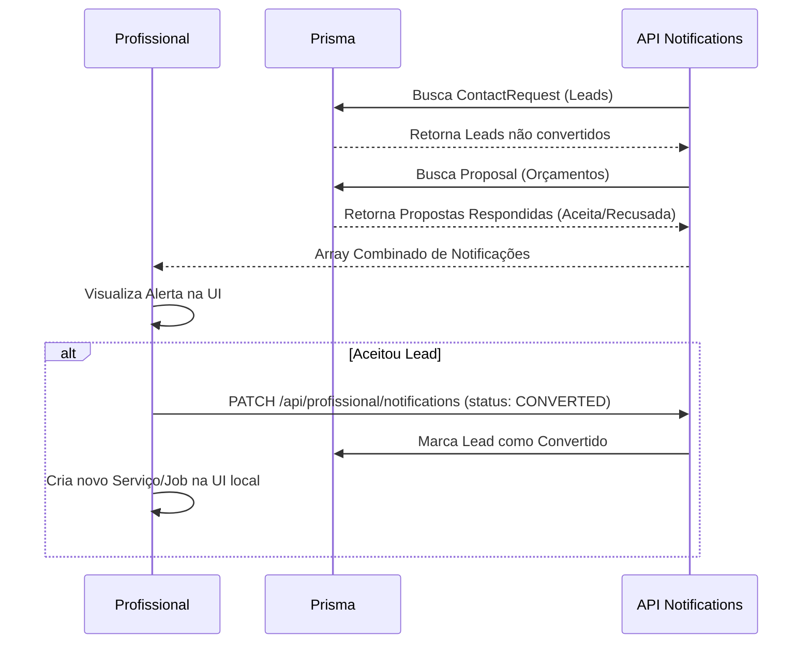

# Fluxograma: Dashboard Profissional e Empresa

## Arquitetura de Dashboards (Client-Side Rendering)

```mermaid
graph TD
    UI[Dashboard Page (React Client)] --> Session{Possui Sessão?}
    Session -- Não --> Redir[/Redireciona para /entrar/]
    Session -- Sim --> DataFetch[Fetch Dados Paralelos]

    DataFetch --> FetchProfile[GET /api/(professionals|companies)/:id]
    DataFetch --> FetchReq[GET /api/profissional/service-requests]
    DataFetch --> FetchNotif[GET /api/profissional/notifications]

    FetchProfile --> SetState[Atualiza Estado Local]
    FetchReq --> SetState
    FetchNotif --> SetState

    SetState --> Render[Renderiza Interface Principal]
    Render --> Lazy[Lazy Load Modais e Calendário]

    Lazy -.-> |Usuário clica em 'Editar Perfil'| ModalProfile[ProfileEditorModal]
    ModalProfile --> Save[PUT /api/users/:id]
    Save --> UpdateDB[Prisma: Atualiza User/Profile]
    UpdateDB --> Reload[Recarrega Dados]
```

## Fluxo de Notificações e Oportunidades


