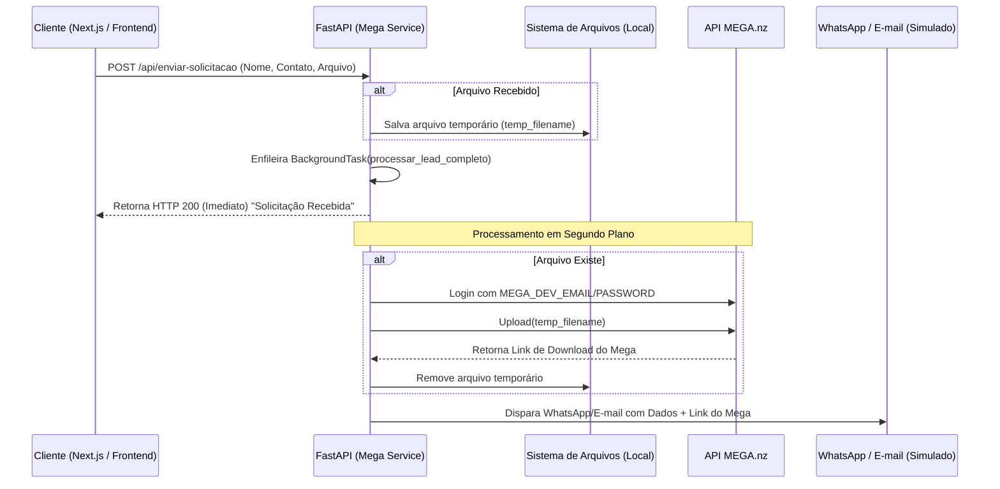

# Fluxograma: Mega Service (Python Microservice)

## Arquitetura de Processamento Assíncrono (FastAPI)

```mermaid
sequenceDiagram
    participant C as Cliente (Next.js / Frontend)
    participant F as FastAPI (Mega Service)
    participant OS as Sistema de Arquivos (Local)
    participant M as API MEGA.nz
    participant W as WhatsApp / E-mail (Simulado)

    C->>F: POST /api/enviar-solicitacao (Nome, Contato, Arquivo)
    
    alt Arquivo Recebido
        F->>OS: Salva arquivo temporário (temp_filename)
    end
    
    F->>F: Enfileira BackgroundTask(processar_lead_completo)
    
    F-->>C: Retorna HTTP 200 (Imediato) "Solicitação Recebida"
    
    %% Início Background Task
    Note over F,M: Processamento em Segundo Plano
    
    alt Arquivo Existe
        F->>M: Login com MEGA_DEV_EMAIL/PASSWORD
        F->>M: Upload(temp_filename)
        M-->>F: Retorna Link de Download do Mega
        F->>OS: Remove arquivo temporário
    end
    
    F->>W: Dispara WhatsApp/E-mail com Dados + Link do Mega
```
