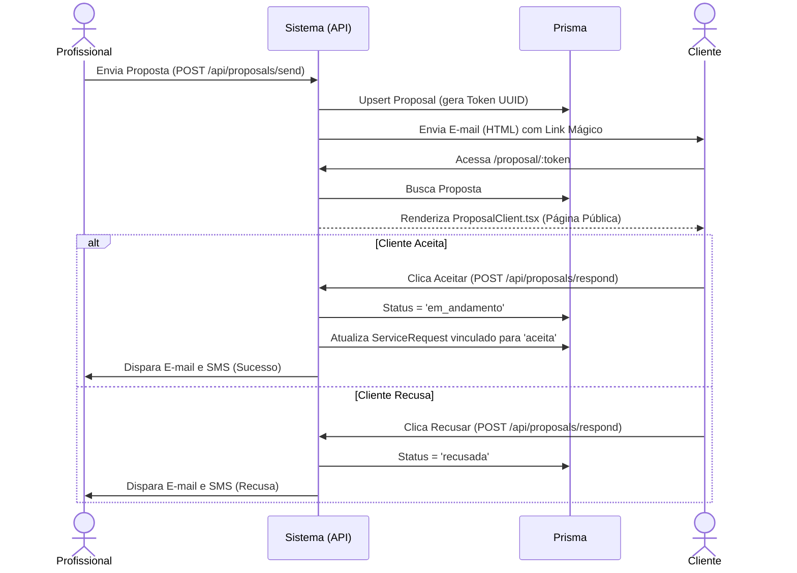

# Fluxograma: Gestão de Propostas e Orçamentos

## Fluxo de Envio e Resposta da Proposta

```mermaid
sequenceDiagram
    actor P as Profissional
    participant S as Sistema (API)
    participant DB as Prisma
    actor C as Cliente

    %% Fluxo de Envio
    P->>S: Envia Proposta (POST /api/proposals/send)
    S->>DB: Upsert Proposal (gera Token UUID)
    S->>C: Envia E-mail (HTML) com Link Mágico
    
    %% Cliente Acessa
    C->>S: Acessa /proposal/:token
    S->>DB: Busca Proposta
    S-->>C: Renderiza ProposalClient.tsx (Página Pública)
    
    %% Cliente Responde
    alt Cliente Aceita
        C->>S: Clica Aceitar (POST /api/proposals/respond)
        S->>DB: Status = 'em_andamento'
        S->>DB: Atualiza ServiceRequest vinculado para 'aceita'
        S->>P: Dispara E-mail e SMS (Sucesso)
    else Cliente Recusa
        C->>S: Clica Recusar (POST /api/proposals/respond)
        S->>DB: Status = 'recusada'
        S->>P: Dispara E-mail e SMS (Recusa)
    end
```
