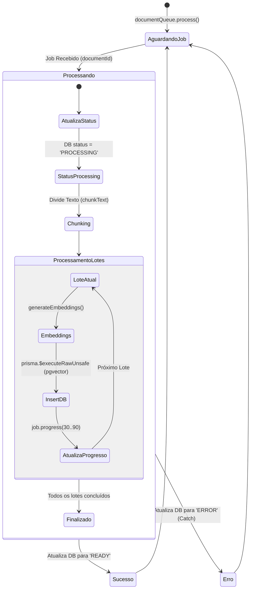

# Fluxograma: Worker (Fila de Tarefas / Redis)

## Ciclo de Vida do Processamento de Documentos em Background

```mermaid
stateDiagram-v2
    [*] --> AguardandoJob: documentQueue.process()
    
    AguardandoJob --> Processando: Job Recebido (documentId)
    
    state Processando {
        [*] --> AtualizaStatus
        AtualizaStatus --> StatusProcessing: DB status = 'PROCESSING'
        StatusProcessing --> Chunking: Divide Texto (chunkText)
        
        Chunking --> ProcessamentoLotes
        
        state ProcessamentoLotes {
            LoteAtual --> Embeddings: generateEmbeddings()
            Embeddings --> InsertDB: prisma.$executeRawUnsafe (pgvector)
            InsertDB --> AtualizaProgresso: job.progress(30..90)
            AtualizaProgresso --> LoteAtual: Próximo Lote
        }
        
        ProcessamentoLotes --> Finalizado: Todos os lotes concluídos
    }
    
    Processando --> Sucesso: Atualiza DB para 'READY'
    Processando --> Erro: Atualiza DB para 'ERROR' (Catch)
    
    Sucesso --> AguardandoJob
    Erro --> AguardandoJob
```
