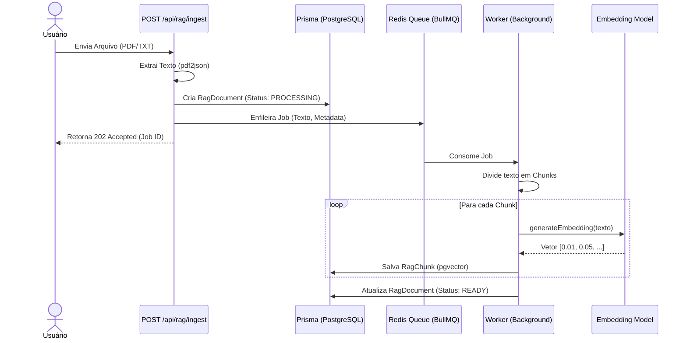
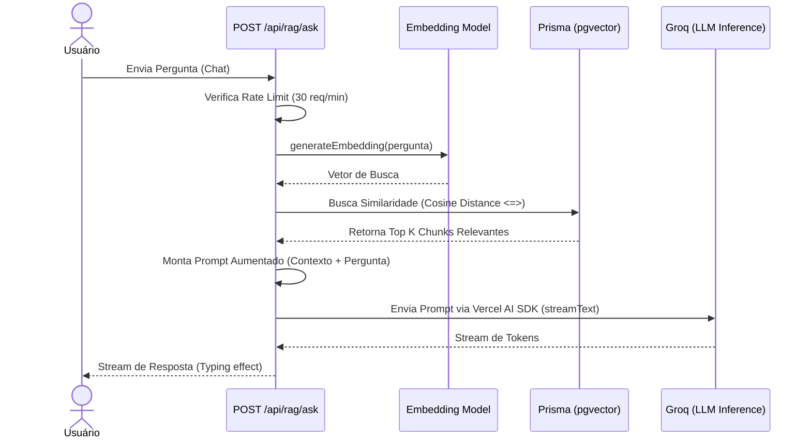

# Fluxograma: RAG AI (Inteligência Artificial)

## Fluxo de Ingestão de Documentos (Assíncrono via BullMQ)

```mermaid
sequenceDiagram
    actor U as Usuário
    participant API as POST /api/rag/ingest
    participant DB as Prisma (PostgreSQL)
    participant Q as Redis Queue (BullMQ)
    participant W as Worker (Background)
    participant LLM as Embedding Model

    U->>API: Envia Arquivo (PDF/TXT)
    API->>API: Extrai Texto (pdf2json)
    API->>DB: Cria RagDocument (Status: PROCESSING)
    API->>Q: Enfileira Job (Texto, Metadata)
    API-->>U: Retorna 202 Accepted (Job ID)
    
    %% Processamento em Background
    Q->>W: Consome Job
    W->>W: Divide texto em Chunks
    
    loop Para cada Chunk
        W->>LLM: generateEmbedding(texto)
        LLM-->>W: Vetor [0.01, 0.05, ...]
        W->>DB: Salva RagChunk (pgvector)
    end
    
    W->>DB: Atualiza RagDocument (Status: READY)
```

## Fluxo de Consulta (Q&A com Vercel AI SDK)

```mermaid
sequenceDiagram
    actor U as Usuário
    participant API as POST /api/rag/ask
    participant LLM as Embedding Model
    participant DB as Prisma (pgvector)
    participant Groq as Groq (LLM Inference)

    U->>API: Envia Pergunta (Chat)
    API->>API: Verifica Rate Limit (30 req/min)
    
    API->>LLM: generateEmbedding(pergunta)
    LLM-->>API: Vetor de Busca
    
    API->>DB: Busca Similaridade (Cosine Distance <=>)
    DB-->>API: Retorna Top K Chunks Relevantes
    
    API->>API: Monta Prompt Aumentado (Contexto + Pergunta)
    
    API->>Groq: Envia Prompt via Vercel AI SDK (streamText)
    Groq-->>API: Stream de Tokens
    API-->>U: Stream de Resposta (Typing effect)
```
