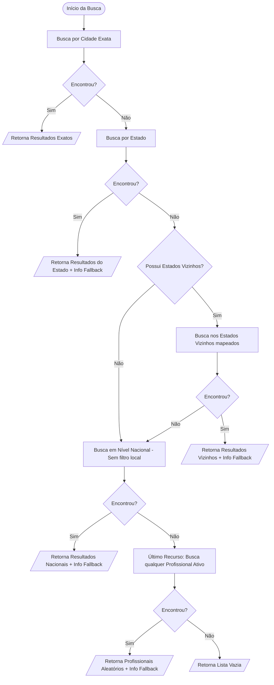

# Fluxograma Detalhado: Lógica de Fallback de Busca

Esta lógica garante que o usuário nunca receba uma "página vazia" se houver profissionais disponíveis em regiões próximas.

### Inteligência de Fallback 🟢
1.  **Dicionário de Vizinhos**: Utiliza o mapa `NEIGHBORING_STATES` (ex: MG faz fronteira com SP, RJ, ES, BA, GO, MS).
2.  **Transparência**: O backend retorna um objeto `fallbackInfo` explicando qual nível de busca foi atingido, permitindo que o frontend exiba mensagens como "Mostrando resultados de todo o Brasil".
3.  **Preservação de Filtros Técnicos**: Especialidade, Avaliação Mínima e Status de Verificação são preservados em todos os níveis de fallback geográfico.
