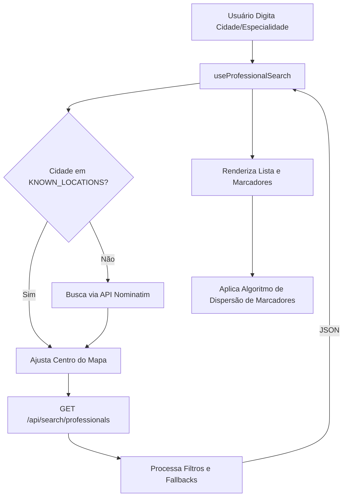
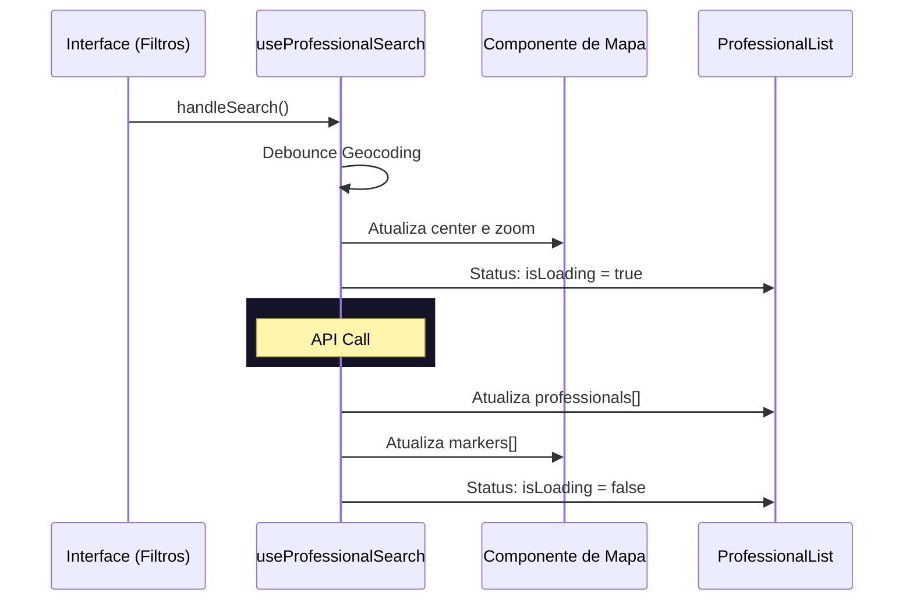

# Fluxogramas: Módulo Buscar-Finder

## Fluxo Geral de Busca de Profissionais

```mermaid
graph TD
    User[Usuário Digita Cidade/Especialidade] --> Hook[useProfessionalSearch]
    Hook --> Geocode{Cidade em KNOWN_LOCATIONS?}
    
    Geocode -- Sim --> SetMap[Ajusta Centro do Mapa]
    Geocode -- Não --> Nominatim[Busca via API Nominatim]
    Nominatim --> SetMap
    
    SetMap --> API[GET /api/search/professionals]
    API --> Backend[Processa Filtros e Fallbacks]
    Backend -- JSON --> Hook
    
    Hook --> Render[Renderiza Lista e Marcadores]
    Render --> Spreading[Aplica Algoritmo de Dispersão de Marcadores]
```

## Sincronização Lista-Mapa (Frontend)

```mermaid
sequenceDiagram
    participant UI as Interface (Filtros)
    participant Hook as useProfessionalSearch
    participant Map as Componente de Mapa
    participant List as ProfessionalList

    UI->>Hook: handleSearch()
    Hook->>Hook: Debounce Geocoding
    Hook->>Map: Atualiza center e zoom
    Hook->>List: Status: isLoading = true
    
    rect rgb(20, 20, 40)
        Note over Hook: API Call
    end

    Hook->>List: Atualiza professionals[]
    Hook->>Map: Atualiza markers[]
    Hook->>List: Status: isLoading = false
```
