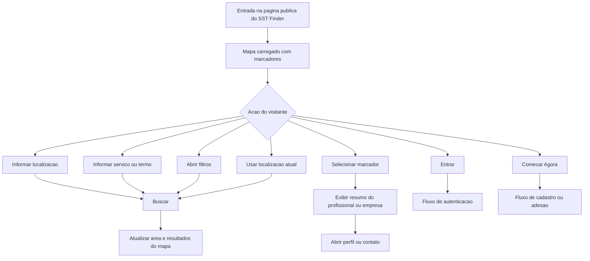
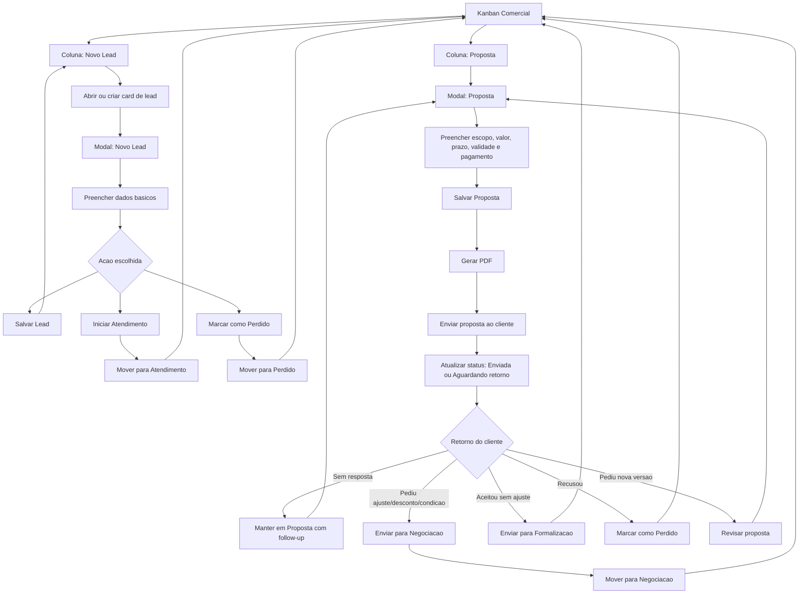

# Fluxo de UI - Kanban Comercial

## Fluxo publico - Finder no mapa

Os passos apos "Buscar", "Selecionar marcador", "Entrar" e "Comecar Agora" sao inferidos porque o screenshot nao mostra os respectivos estados de destino.

---

## Pontos de entrada

- Acesso direto ao Kanban Comercial.
- Acao sobre um card existente na coluna "Novo Lead".
- Possivel criacao de novo card a partir da etapa "Novo Lead".

## Pontos de saida

- Fechar modal sem acao visivel.
- Salvar lead permanecendo em "Novo Lead".
- Iniciar atendimento, avancando o lead para a etapa "Atendimento".
- Marcar como perdido, enviando o lead para a etapa "Perdido".
- Salvar proposta mantendo o card na etapa "Proposta".
- Gerar PDF da proposta.
- Enviar para negociacao quando a proposta estiver enviada/validada e houver retorno ou tratativa comercial.
- Manter em "Proposta" quando ainda for apenas rascunho ou aguardando envio.

## Regra recomendada para transicao Proposta -> Negociacao

O card deve ir para "Negociacao" quando a proposta ja foi formalizada para o cliente e existe uma conversa ativa sobre condicoes, ajustes, desconto, prazo, forma de pagamento ou aceite. Se o status interno ainda for "Rascunho", a acao correta e salvar ou gerar PDF, nao avancar.

## Regra recomendada para retorno do cliente

Depois de enviada, a proposta deve permanecer na etapa "Proposta" ate o retorno ser classificado. Sem resposta gera follow-up. Pedido de ajuste, desconto ou condicao leva para "Negociacao". Aceite sem ajustes leva para "Formalizacao". Recusa leva para "Perdido". Pedido de nova versao mantem em "Proposta" para revisao.
